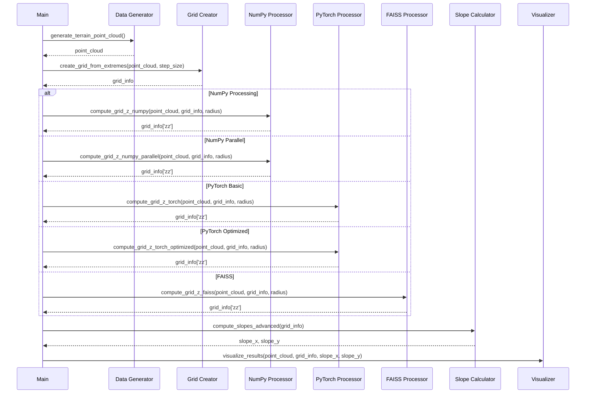
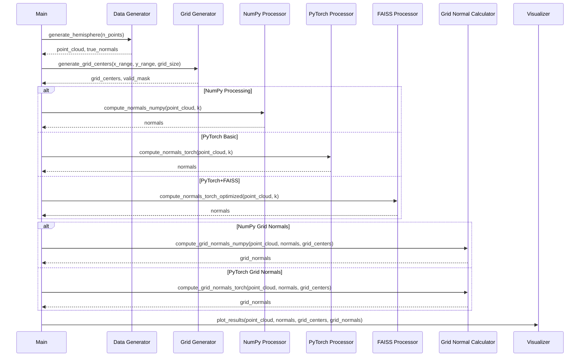
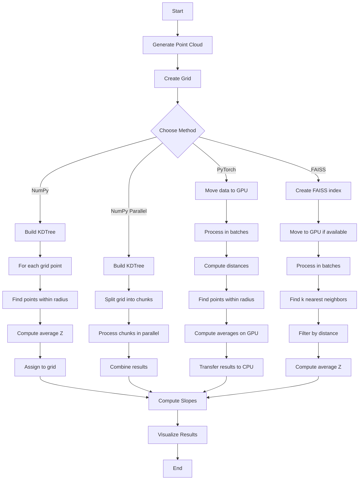
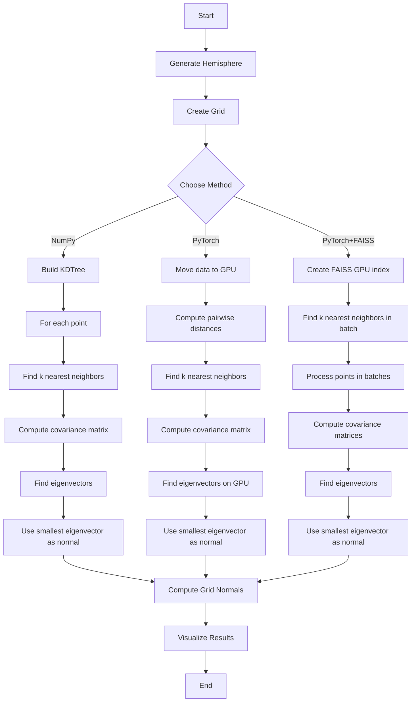

# Point Cloud Processing Library

This library provides tools for processing point cloud data, with a focus on grid-based terrain analysis and normal vector computation. The library includes multiple implementations that leverage both CPU and GPU acceleration techniques, allowing performance comparison across different computational approaches.

## Table of Contents
- [Overview](#overview)
- [Dependencies](#dependencies)
- [Grid Computation Module](#grid-computation-module)
  - [Methods](#grid-methods)
  - [Benchmark Results](#grid-benchmark-results)
- [Normal Computation Module](#normal-computation-module)
  - [Methods](#normal-methods)
  - [Benchmark Results](#normal-benchmark-results)
- [Usage Examples](#usage-examples)
- [Sequence Diagrams](#sequence-diagrams)
- [Activity Diagrams](#activity-diagrams)

## Overview

The library consists of two main modules:

1. **Grid Computation (`gridtester.py`)** - Creates a regular grid over a point cloud and computes average Z-values and slope information.
2. **Normal Computation (`normalstester.py`)** - Computes normal vectors for each point in a point cloud and aggregates them into a grid.

Both modules provide multiple implementation approaches, including:
- Pure NumPy (CPU-based) computation
- Parallel NumPy computation using joblib
- PyTorch-based computation (GPU-accelerated)
- FAISS-based computation (GPU-accelerated for nearest neighbor searches)

## Dependencies

- NumPy - For array operations and basic computation
- SciPy - For spatial data structures (KDTree)
- PyTorch - For GPU-accelerated computation
- FAISS - For GPU-accelerated nearest neighbor search
- Joblib - For parallel CPU computation
- Matplotlib - For visualization

### Environment Setup

Order is important in this setup because of overlapping dependencies for the Math Kernel Library (MKL) from intel which is used by both torch and scipy.  In addition to this, torch needs to reference the target CUDA install with the --index-url flag.  The URL should correspond to your installed CUDA version, e.g. 11.8 or 12.1

Faiss has both GPU and CPU variants.  Because of the nature of this analysis, GPU version was used.

- torch - pip
- torchvision - pip  //use --index-url https://download.pytorch.org/whl/cu121 or whatever CUDA version is loaded
- numpy - conda
- scipy=1.9.3
- faiss-gpu - conda -c nvidia
- matplotlib - pip
- joblib - pip

## Grid Computation Module

The grid computation module (`gridtester.py`) provides functionality to:
1. Generate synthetic terrain data
2. Create a regular grid over the terrain
3. Compute Z-values for each grid point by averaging nearby point cloud Z-values
4. Calculate terrain slopes in X and Y directions
5. Visualize the results

### Grid Methods

#### 1. NumPy Implementation (`compute_grid_z_numpy`)

The NumPy implementation uses SciPy's KDTree for efficient nearest neighbor searches. For each grid point, it:
1. Finds all point cloud points within a specified radius
2. Computes the average Z-value of these points
3. Assigns this average Z-value to the grid point

```python
def compute_grid_z_numpy(point_cloud, grid_info, radius=0.05):
    """Compute average z-values for grid points using NumPy and KDTree."""
    # Build KDTree using only X and Y coordinates
    tree = KDTree(point_cloud[:, :2])
    
    grid_centers = grid_info['centers']
    
    # For each grid center, find points within radius and compute average Z
    for i, center in enumerate(grid_centers):
        indices = tree.query_ball_point(center[:2], r=radius)
        if indices:
            grid_centers[i, 2] = np.mean(point_cloud[indices, 2])
    
    # Reshape z-values to grid
    zz = grid_centers[:, 2].reshape(grid_info['size_y'], grid_info['size_x'])
    
    return zz
```

#### 2. Parallel NumPy Implementation (`compute_grid_z_numpy_parallel`)

The parallel NumPy implementation extends the base NumPy approach by dividing the workload across multiple CPU cores using joblib's Parallel and delayed functions. It:
1. Builds a single KDTree (shared across all workers)
2. Divides the grid points into chunks
3. Processes each chunk in parallel on different CPU cores
4. Combines the results

```python
def compute_grid_z_numpy_parallel(point_cloud, grid_info, radius=0.05, n_jobs=-1):
    """Optimized parallel CPU implementation using NumPy and KDTree."""
    from joblib import Parallel, delayed
    import multiprocessing
    
    # Build KDTree using only X and Y coordinates (done once for all workers)
    tree = KDTree(point_cloud[:, :2])
    
    # Determine number of CPU cores to use
    n_jobs = n_jobs if n_jobs > 0 else multiprocessing.cpu_count()
    
    # Get total grid points
    n_grid_points = len(grid_info['centers'])
    
    # Split work more evenly with larger chunks
    chunk_size = max(100, n_grid_points // n_jobs)
    
    # Helper function to process a chunk of grid points
    def process_chunk(start_idx, end_idx):
        chunk_results = np.zeros(end_idx - start_idx)
        for i in range(end_idx - start_idx):
            idx = start_idx + i
            center = grid_info['centers'][idx]
            indices = tree.query_ball_point(center[:2], r=radius)
            if indices:
                chunk_results[i] = np.mean(point_cloud[indices, 2])
        return chunk_results
    
    # Create chunks
    chunks = [(i, min(i + chunk_size, n_grid_points)) 
              for i in range(0, n_grid_points, chunk_size)]
    
    # Process chunks in parallel
    results = Parallel(n_jobs=n_jobs, verbose=0)(
        delayed(process_chunk)(start, end) for start, end in chunks
    )
    
    # Combine results
    grid_z = np.zeros(n_grid_points)
    for i, (start, end) in enumerate(chunks):
        grid_z[start:end] = results[i]
    
    # Reshape to grid
    zz = grid_z.reshape(grid_info['size_y'], grid_info['size_x'])
    
    return zz
```

#### 3. Basic PyTorch Implementation (`compute_grid_z_torch`)

The basic PyTorch implementation computes grid Z-values using GPU acceleration for distance calculations. It:
1. Moves data to the GPU
2. Processes grid points in batches
3. Computes pairwise distances between grid points and cloud points
4. Finds points within the radius for each grid point
5. Computes average Z-values on the GPU

```python
def compute_grid_z_torch(point_cloud, grid_info, radius=0.1):
    """Compute average z-values for grid points using PyTorch with batch processing."""
    # Move data to GPU
    point_cloud_gpu = torch.tensor(point_cloud, dtype=torch.float32, device="cuda")
    grid_centers = grid_info['centers']
    grid_centers_gpu = torch.tensor(grid_centers, dtype=torch.float32, device="cuda")
    
    # Process in batches for better performance
    batch_size = 100  # Process this many grid points at once
    
    for batch_start in range(0, len(grid_centers_gpu), batch_size):
        batch_end = min(batch_start + batch_size, len(grid_centers_gpu))
        batch_centers = grid_centers_gpu[batch_start:batch_end]
        
        # Compute pairwise distances between batch centers and all points
        expanded_centers = batch_centers[:, None, :2]  # [batch, 1, 2]
        expanded_points = point_cloud_gpu[None, :, :2]  # [1, n_points, 2]
        
        # Compute squared distances
        distances = torch.sum((expanded_centers - expanded_points)**2, dim=2)  # [batch, n_points]
        
        # Find points within radius for each center
        masks = distances <= radius**2  # [batch, n_points]
        
        # Compute average Z for each center in the batch
        for i in range(len(batch_centers)):
            mask = masks[i]
            if torch.any(mask):
                batch_centers[i, 2] = torch.mean(point_cloud_gpu[mask, 2])
        
        # Update the original grid_centers_gpu with computed z-values
        grid_centers_gpu[batch_start:batch_end, 2] = batch_centers[:, 2]
    
    # Copy back to CPU and update grid_centers
    grid_centers[:, 2] = grid_centers_gpu[:, 2].cpu().numpy()
    
    # Reshape z-values to grid
    zz = grid_centers[:, 2].reshape(grid_info['size_y'], grid_info['size_x'])
    
    return zz
```

#### 4. Optimized PyTorch Implementation (`compute_grid_z_torch_optimized`)

The optimized PyTorch implementation further improves the basic version by:
1. Processing both grid points and point cloud in smaller chunks to avoid memory issues
2. Using more efficient vectorized operations for calculating sums and counts
3. Minimizing data transfers between CPU and GPU

```python
def compute_grid_z_torch_optimized(point_cloud, grid_info, radius=0.05):
    """Memory-efficient GPU implementation with chunked processing."""
    # Move data to GPU
    point_cloud_gpu = torch.tensor(point_cloud, dtype=torch.float32, device="cuda")
    point_xy = point_cloud_gpu[:, :2]
    point_z = point_cloud_gpu[:, 2]
    
    grid_centers = grid_info['centers']
    grid_centers_gpu = torch.tensor(grid_centers, dtype=torch.float32, device="cuda")
    
    # Initialize results
    grid_z = torch.zeros(len(grid_centers_gpu), device="cuda")
    
    # Process grid points in small chunks
    grid_chunk_size = 64
    
    # Process point cloud in chunks too
    point_chunk_size = 10000
    
    for grid_start in range(0, len(grid_centers_gpu), grid_chunk_size):
        grid_end = min(grid_start + grid_chunk_size, len(grid_centers_gpu))
        grid_chunk = grid_centers_gpu[grid_start:grid_end, :2]
        
        # Initialize accumulators for this grid chunk
        sum_z = torch.zeros(grid_end - grid_start, device="cuda")
        count = torch.zeros(grid_end - grid_start, device="cuda")
        
        # Process point cloud in chunks
        for point_start in range(0, len(point_cloud_gpu), point_chunk_size):
            point_end = min(point_start + point_chunk_size, len(point_cloud_gpu))
            
            # Extract chunk
            point_xy_chunk = point_xy[point_start:point_end]
            point_z_chunk = point_z[point_start:point_end]
            
            # Calculate pairwise distances (grid_chunk x point_chunk)
            grid_expanded = grid_chunk.unsqueeze(1)  # [grid_chunk, 1, 2]
            point_expanded = point_xy_chunk.unsqueeze(0)  # [1, point_chunk, 2]
            dist_sq = torch.sum((grid_expanded - point_expanded)**2, dim=2)  # [grid_chunk, point_chunk]
            
            # Get mask of points within radius
            mask = dist_sq <= radius**2  # [grid_chunk, point_chunk]
            
            # Vectorized sum and count
            point_z_expanded = point_z_chunk.unsqueeze(0)  # [1, point_chunk_size]
            sum_z_chunk = torch.sum(point_z_expanded * mask.float(), dim=1)  # [grid_chunk_size]
            count_chunk = torch.sum(mask, dim=1)  # [grid_chunk_size]
            
            # Update totals
            sum_z += sum_z_chunk
            count += count_chunk
        
        # Compute averages for this grid chunk
        valid_mask = count > 0
        grid_z[grid_start:grid_end][valid_mask] = sum_z[valid_mask] / count[valid_mask]
    
    # Reshape to grid
    zz = grid_z.cpu().numpy().reshape(grid_info['size_y'], grid_info['size_x'])
    
    return zz
```

#### 5. FAISS Implementation (`compute_grid_z_faiss`)

The FAISS implementation leverages the GPU-accelerated nearest neighbor search capabilities of the FAISS library:
1. Creates a FAISS index for efficient k-NN search
2. Moves the index to GPU if possible
3. Processes grid points in batches
4. For each batch, finds k nearest neighbors and filters by distance
5. Computes average Z-values

```python
def compute_grid_z_faiss(point_cloud, grid_info, radius=0.025):
    """Use FAISS (GPU-accelerated) for nearest neighbor search using k-NN and CPU-side averaging."""
    # Create FAISS index (on CPU first for safer initialization)
    index = faiss.IndexFlatL2(2)  # 2D index (x,y only)
    index.add(point_cloud[:, :2].astype(np.float32))  # FAISS requires float32

    # Move to GPU if available
    if hasattr(faiss, 'StandardGpuResources'):
        try:
            res = faiss.StandardGpuResources()
            index = faiss.index_cpu_to_gpu(res, 0, index)
        except Exception as e:
            print(f"  Could not use GPU FAISS: {e}. Falling back to CPU.")

    # Initialize results
    grid_z = np.zeros(len(grid_info['centers']))
    radius_sq = radius**2

    # Determine maximum number of neighbors to fetch
    point_density = len(point_cloud) / ((np.max(point_cloud[:, 0]) - np.min(point_cloud[:, 0])) * 
                                      (np.max(point_cloud[:, 1]) - np.min(point_cloud[:, 1])))
    avg_neighbors = int(np.ceil(point_density * np.pi * radius**2 * 2))  # Add safety factor of 2
    k = min(max(30, avg_neighbors), 500)  # Limit between 30 and 500

    # Process grid points in batches
    batch_size = 256
    for i in range(0, len(grid_info['centers']), batch_size):
        end = min(i + batch_size, len(grid_info['centers']))
        query_batch = grid_info['centers'][i:end, :2].astype(np.float32)

        # Use k-NN search and filter by distance
        distances, indices = index.search(query_batch, k)

        # Process each grid point
        for j in range(end - i):
            # Get valid neighbors (within radius and not padding)
            valid_mask = (distances[j] <= radius_sq) & (indices[j] >= 0)
            valid_indices = indices[j][valid_mask]

            if len(valid_indices) > 0:
                grid_z[i+j] = np.mean(point_cloud[valid_indices, 2])

    # Reshape to grid
    zz = grid_z.reshape(grid_info['size_y'], grid_info['size_x'])
    return zz
```

#### Slope Computation Methods

After computing grid Z-values, the module provides two methods for computing slopes:

1. **Advanced CPU-based method (`compute_slopes_advanced`)**: 
   - Handles edge points and interior points differently
   - Uses ray projection through min/max neighbors for interior points
   - Calculates slopes in X and Y directions

2. **GPU-accelerated method (`compute_slopes_torch_optimized`)**:
   - Uses PyTorch's 2D convolution operations with Sobel-like kernels
   - Handles padding to maintain grid dimensions
   - Performs all computations on the GPU

### Grid Benchmark Results

Benchmark results from testing on various dataset sizes show:

| Method | Small Dataset (50K points) | Large Dataset (10M points) |
|--------|----------------------------|----------------------------|
| NumPy | 0.21s | 1.56s |
| NumPy (Parallel) | 0.71s | 0.62s |
| PyTorch (Basic) | 1.42s | 4.82s |
| PyTorch (Optimized) | 23.52s | N/A |
| FAISS (GPU) | N/A | 2.34s |

Key observations:
- For small datasets, the simple NumPy implementation is fastest
- For larger datasets, the parallel NumPy implementation shows better scaling
- PyTorch implementations don't perform well for this specific nearest-neighbor task
- FAISS becomes more competitive with very large datasets

## Normal Computation Module

The normal computation module (`normalstester.py`) provides functionality to:
1. Generate synthetic point cloud data (hemisphere)
2. Compute normal vectors for each point in the cloud
3. Aggregate normal vectors into a grid
4. Visualize point cloud with normal vectors

### Normal Methods

#### 1. NumPy Implementation (`compute_normals_numpy`)

The NumPy implementation uses SciPy's KDTree for finding nearest neighbors. For each point, it:
1. Finds k nearest neighbors
2. Centers the neighbors around the point
3. Computes the covariance matrix
4. Calculates eigenvectors/eigenvalues
5. Uses the eigenvector with smallest eigenvalue as the normal

```python
def compute_normals_numpy(point_cloud, k=10):
    tree = KDTree(point_cloud)
    normals = np.zeros_like(point_cloud)
    
    for i, point in enumerate(point_cloud):
        # Find k nearest neighbors
        distances, indices = tree.query(point, k=k+1)  # +1 because the point itself is included
        neighbors = point_cloud[indices[1:]]  # Exclude the point itself
        
        # Center the neighbors
        centered = neighbors - point
        
        # Compute covariance matrix
        cov = np.cov(centered, rowvar=False)
        
        # Compute eigenvectors and eigenvalues
        eigenvalues, eigenvectors = np.linalg.eigh(cov)
        
        # The normal is the eigenvector corresponding to the smallest eigenvalue
        normal = eigenvectors[:, 0]
        
        # Normalize
        normal = normal / np.linalg.norm(normal)
        normals[i] = normal
    
    return normals
```

#### 2. Basic PyTorch Implementation (`compute_normals_torch`)

The basic PyTorch implementation computes normals using GPU acceleration:
1. Moves data to the GPU
2. Computes pairwise distances on the GPU
3. Identifies k nearest neighbors for each point
4. Computes covariance matrices and eigenvectors on the GPU

```python
def compute_normals_torch(point_cloud, k=10):
    # Move to GPU
    point_cloud_gpu = torch.tensor(point_cloud, device="cuda")
    n_points = point_cloud_gpu.shape[0]
    normals = torch.zeros_like(point_cloud_gpu)
    
    # Compute pairwise distances
    expanded_points1 = point_cloud_gpu.unsqueeze(1).repeat(1, n_points, 1)  # [n, n, 3]
    expanded_points2 = point_cloud_gpu.unsqueeze(0).repeat(n_points, 1, 1)  # [n, n, 3]
    squared_dists = torch.sum((expanded_points1 - expanded_points2)**2, dim=2)  # [n, n]
    
    # Get k nearest neighbors for each point
    _, indices = torch.topk(squared_dists, k=k+1, dim=1, largest=False)
    
    for i in range(n_points):
        # Get neighbors (excluding the point itself)
        neighbor_indices = indices[i, 1:k+1]
        neighbors = point_cloud_gpu[neighbor_indices]
        
        # Center the neighbors
        centered = neighbors - point_cloud_gpu[i]
        
        # Compute covariance matrix
        cov = torch.matmul(centered.t(), centered) / (k - 1)
        
        # Compute eigenvectors and eigenvalues
        eigenvalues, eigenvectors = torch.linalg.eigh(cov)
        
        # The normal is the eigenvector corresponding to the smallest eigenvalue
        normal = eigenvectors[:, 0]
        
        # Normalize
        normal = normal / torch.norm(normal)
        normals[i] = normal
    
    return normals
```

#### 3. FAISS-accelerated PyTorch Implementation (`compute_normals_torch_optimized`)

The optimized implementation uses FAISS for efficient k-NN search:
1. Creates a GPU index using FAISS
2. Uses the index to find k nearest neighbors for all points
3. Processes points in batches for better GPU utilization
4. Computes normals using eigenvector analysis as in other methods

```python
def compute_normals_torch_optimized(point_cloud, k=10):
    point_cloud_gpu = torch.tensor(point_cloud, device="cuda")
    n_points = point_cloud_gpu.shape[0]
    
    # Create GPU index
    res = faiss.StandardGpuResources()
    index = faiss.GpuIndexFlatL2(res, 3)  # 3D points
    index.add(point_cloud_gpu)
    
    # Query for k nearest neighbors
    _, indices = index.search(point_cloud_gpu, k+1)  # [n_points, k+1]
    
    normals = torch.zeros_like(point_cloud_gpu)
    
    # Process in batches for better GPU utilization
    batch_size = 1024
    for batch_start in range(0, n_points, batch_size):
        batch_end = min(batch_start + batch_size, n_points)
        batch_indices = indices[batch_start:batch_end, 1:k+1]  # Exclude the point itself
        
        # Get batched neighbors
        batch_neighbors = point_cloud_gpu[batch_indices]  # [batch_size, k, 3]
        batch_points = point_cloud_gpu[batch_start:batch_end].unsqueeze(1)  # [batch_size, 1, 3]
        
        # Center the neighbors
        centered = batch_neighbors - batch_points
        
        # Process each point in the batch
        for i in range(batch_end - batch_start):
            # Compute covariance matrix for this point
            cov = torch.matmul(centered[i].t(), centered[i]) / (k - 1)
            eigenvalues, eigenvectors = torch.linalg.eigh(cov)
            normal = eigenvectors[:, 0]
            normal = normal / torch.norm(normal)
            normals[batch_start + i] = normal
    
    return normals
```

#### Grid Normal Computation Methods

The module also provides methods to aggregate point normals into a grid:

1. **NumPy implementation (`compute_grid_normals_numpy`)**:
   - Uses KDTree to find points within a radius of each grid point
   - Averages the normals of these points
   - Normalizes the result

2. **PyTorch implementation (`compute_grid_normals_torch`)**:
   - Performs the same computation on the GPU
   - Uses distance calculations to create masks for points within radius
   - Averages normals using GPU-accelerated operations

### Normal Benchmark Results

Benchmark results from testing with a 5,000-point hemisphere:

| Method | Time (seconds) |
|--------|----------------|
| NumPy | 0.28s |
| PyTorch | 2.35s |
| PyTorch+FAISS | 1.75s |

Key observations:
- NumPy is surprisingly faster than GPU methods for this task with this dataset size
- The basic PyTorch implementation has significant overhead
- FAISS helps improve the PyTorch performance but still doesn't match NumPy
- For larger datasets, the GPU methods may become more competitive

## Usage Examples

### Grid Computation Example

```python
# Parameters
n_points = 500000     # Number of points in the point cloud
step_size = 0.05      # Grid step size (in meters)
radius = 0.025        # Search radius for averaging (in meters)

# Generate a synthetic terrain point cloud
point_cloud = generate_terrain_point_cloud(n_points)

# Create a grid over the terrain
grid_info = create_grid_from_extremes(point_cloud, step_size)

# Compute grid Z-values using NumPy (fastest for small datasets)
grid_info['zz'] = compute_grid_z_numpy(point_cloud, grid_info, radius)

# Compute slopes
slope_x, slope_y = compute_slopes_advanced(grid_info)

# Visualize results
visualize_results(point_cloud, grid_info, slope_x, slope_y)
```

### Normal Computation Example

```python
# Parameters
n_points = 5000        # Number of points in the point cloud
k_neighbors = 20       # Number of neighbors for normal computation
grid_size = 20         # Size of the grid for aggregating normals

# Generate synthetic hemisphere data
point_cloud, true_normals = generate_hemisphere(n_points)

# Compute normals using NumPy
normals = compute_normals_numpy(point_cloud, k=k_neighbors)

# Generate grid for aggregating normals
grid_centers, valid_mask = generate_grid_centers([-1, 1], [-1, 1], grid_size)

# Compute grid normals
grid_normals = compute_grid_normals_numpy(point_cloud, normals, grid_centers, radius=0.2)

# Visualize results
plot_results(point_cloud, normals, grid_centers, grid_normals)
```

## Sequence Diagrams

### Grid Computation Sequence



### Normal Computation Sequence



## Activity Diagrams

### Grid Z-Value Computation Activity



### Normal Computation Activity



## Performance Analysis

### Grid Computation Performance

The performance of the different grid computation methods varies significantly depending on the size of the dataset and the computational resources available:

1. **NumPy (Single-threaded)**: 
   - Best for small to medium datasets (up to ~1 million points)
   - Leverages highly optimized KDTree implementation
   - Low overhead, efficient memory usage
   - Limited by single-core processing for larger datasets

2. **NumPy (Parallel)**:
   - Scales better for larger datasets
   - Good speedup on multi-core systems
   - Overhead may not be worth it for small datasets
   - Best choice for large datasets on systems without powerful GPUs

3. **PyTorch (Basic)**:
   - Higher overhead due to data transfer between CPU and GPU
   - Not competitive for small datasets
   - For this specific nearest-neighbor task, not as efficient as expected

4. **PyTorch (Optimized)**:
   - Memory-efficient for large datasets
   - Still suffers from high overhead
   - Complex implementation with limited performance gain

5. **FAISS (GPU)**:
   - Specialized for nearest neighbor search
   - Becomes competitive for very large datasets
   - Requires additional library dependencies
   - Best choice for huge datasets with powerful GPUs

### Normal Computation Performance

For normal computation, the performance characteristics show:

1. **NumPy**:
   - Surprisingly efficient for small to medium datasets
   - Well-optimized KDTree implementation

2. **PyTorch**:
   - Higher overhead due to GPU data transfer
   - Not competitive for smaller datasets
   - May become advantageous for very large point clouds

3. **PyTorch+FAISS**:
   - Better than basic PyTorch but still slower than NumPy for tested datasets
   - Could be beneficial for very large datasets

## Considerations for Neural Network Approach

A neural network-based approach for processing point clouds could potentially outperform the traditional methods for certain applications:

1. **Rasterized Height Map Approach**:
   - Convert point cloud to high-resolution height map image
   - Use CNN to predict slopes directly
   - Leverage highly optimized GPU computation for image processing
   - One-time training cost, but fast inference

2. **Point Cloud Networks**:
   - Networks like PointNet could directly process 3D point data
   - Learn to extract features and compute normals/slopes simultaneously
   - May handle irregular point distributions better than grid-based methods

3. **Trade-offs**:
   - Higher upfront cost (training time, data preparation)
   - Very fast inference time once trained
   - May lose precision compared to direct computation
   - Well-suited for repetitive processing of similar point clouds

## Conclusion

This library provides multiple implementations for point cloud processing tasks, with trade-offs between simplicity, performance, and resource requirements. The benchmarks demonstrate that the most sophisticated approach is not always the fastest, and the choice of method should depend on dataset size, available hardware, and specific requirements.

Key findings:
- For small datasets, the simple NumPy implementation is hard to beat
- For large datasets, parallel NumPy or GPU-accelerated methods become competitive
- The right balance between CPU and GPU processing depends on the specific task

Future work could include:
- Developing a hybrid approach that selects the best method based on input characteristics
- Implementing a neural network-based solution for specific applications
- Further optimizing the PyTorch implementations to better leverage GPU capabilities
